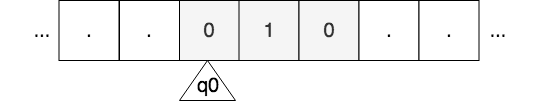

# Multitape Turing Machine Simulator

A Turing Machine is a very simple model of computation that can represent any algorithm. Models like this one are very helpful in Computer Science because one of the main concerns in this discipline is to know if there exist an algorithm that solves a given problem. __If we can find a model of computation that solves the problem, then we can be sure that such algorithm exists__. 

And after knowing that the given problem can be solved, another question that Computer Science try to answer is to know the efficiency of the algorithm in terms of time consumption and space needed, this way we can decide which algorithm is better in case we have more than one that solves the same problem. Using a model of computation here is helpful because it __allows the study of algorithms independently of the physical computer where the algorithms are run__.

Turing Machines are models that operate on an infinity memory tape. The machine head reads a symbol from the tape, writes a symbol and moves to the left or right. The write and move are defined by the transition function which determines the symbol to write and the move given the current state and symbol read. The machine halts if there are no transitions for the current state and symbol read. Then, if the state is part of the accepting state set the input string is considered to be accepted as part of the language that the machine recognizes. Note that the machine may never stop.

<p align="center">
	
</p>

There are many Turing Machine variants which have the same computational power. They exist because using them make some proofs easier to demonstrate. The simulator implemented in this repository is a simulator of the multitape variant of the Turing Machine that also considers the "Stop" move in addition to the "Left" and "Right" moves.

This Turing Machine is formally defined as a tuple `(Q, Σ, Γ, b, s, F, δ)`, where:

- __Q__: is the set of states of the machine
- __Σ__: is the set of symbols of the input string
- __Γ__: is the set of symbols of the tape. (Σ ⊂ Γ)
- __b__: is the blank symbol. Initially all the positions in the memory tape that are not filled with the input string symbols are set to blank. (b ∈ Γ) 
- __s__: is the starting symbol. (s ∈ Q)
- __F__: is the set of accepting states. If the machine stops in one of these states the input string is considered accepted in the language that the machine recognizes (F ⊆ Q)
- __δ__: is the transition function. (δ: Q ×  Γ<sup>k</sup> → Q × (Γ × {L, R, S})<sup>k</sup>). It is a map from the given state and inputs from the different tapes to the next state and the symbol to write to each tape and move to do in each tape.

## Usage Example

```
$ java -jar MTSSimulator.jar examples/concat_ones_and_zeroes.config examples/concat_ones_and_zeroes.input1
. 1 1 1 1 1 0 0 . 1 1 1 1 1 . 0 0 .
. 1 1 1 1 1 .
. 0 0 .
Accepted: true
```

Note that in the input file there must be a line for each tape. In the example above we are only using the first tape so the second and third lines of the file are just empty lines.

Also note that it is not necessary to input the number of tapes in the input file, they are inferred from the first transition